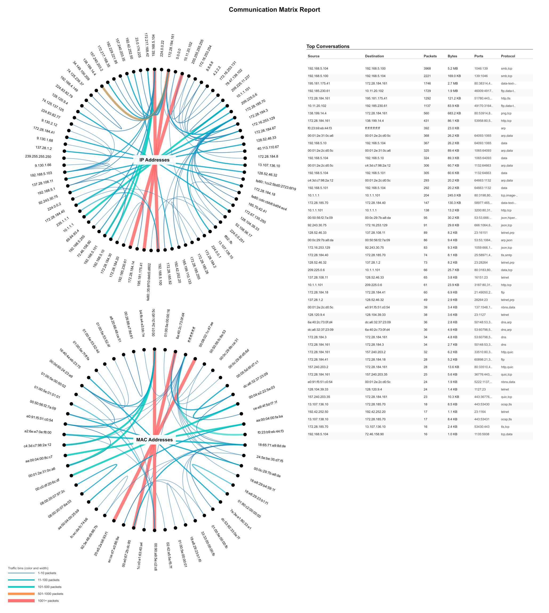

# Communication Matrix Report - Wireshark Plugin
[]()
[]()
[]()
[]()
[]()

Beautiful circular network communication visualization with integrated conversation analysis table.



## Overview

Communication Matrix Report is a Wireshark plugin that generates comprehensive network communication diagrams with:

- **Dual Circle View**: IP addresses (top) and MAC addresses (bottom) in circular layouts
- **Smart Node Placement**: Automatically positions communicating pairs opposite each other for clarity
- **Top Conversations Table**: Side-by-side table showing the busiest communications with packet counts, bytes, ports, and protocols
- **Export Options**: Generate PNG, SVG, or PDF reports
- **Heat Map Colors**: Visual traffic intensity from blue (low) to red (very high)

## Features

### Visual Elements

- **IP Circle (Top)**: Shows Layer 3 communication patterns (IPv4/IPv6)
- **MAC Circle (Bottom)**: Shows Layer 2 communication patterns (Ethernet/Wi-Fi)
- **Conversation Table**: Lists top 50 conversations sorted by packet count
  - Source and destination addresses
  - Packet counts
  - Byte counts (formatted as KB/MB/GB)
  - Port information (TCP/UDP)
  - Protocol information

### Smart Features

- **Intelligent Address Display**: Uses IP addresses for IP traffic, MAC addresses only for non-IP protocols (ARP, LLDP, STP, CDP)
- **Optimized Layout**: Busiest communication pairs positioned opposite each other and evenly spaced
- **Traffic Bins**: 5 color-coded traffic levels (1-10, 11-100, 101-500, 501-1000, 1001+)
- **Center Labels**: Bold labels in circle centers identify address types

## Installation

### Quick Install (Recommended)

Choose your platform:

- **macOS**: [Mac Installer](./Mac_Installer/README.md)
- **Linux**: [Linux Installer](./Linux_Installer/README.md)
- **Windows**: [Windows Installer](./Windows_Installer/README.md)

### Manual Installation

1. Copy `comm_matrix_table_view.lua` to your Wireshark plugins directory:
   - **macOS/Linux**: `~/.local/lib/wireshark/plugins/`
   - **Windows**: `%APPDATA%\Wireshark\plugins\`

2. Install PNG export dependency (optional but recommended):
   ```bash
   # macOS
   brew install librsvg
   
   # Ubuntu/Debian
   sudo apt install librsvg2-bin
   
   # Fedora/RHEL
   sudo dnf install librsvg2-tools
   
   # Windows
   # Download from https://github.com/miyako/console-rsvg-convert
   ```

3. Restart Wireshark

## Usage

### Basic Workflow

1. **Open capture file** or start live capture in Wireshark
2. **Apply display filter** (optional) to focus on specific traffic
3. **Open plugin**: Go to `Tools → Communication Matrix Report`
4. **Wait for processing**: Plugin analyzes all packets in current display
5. **View results**: Click "Open PNG" to view visualization

### Export Options

- **Open PNG**: Converts SVG to PNG and opens in default viewer (requires rsvg-convert)
- **Open SVG**: Opens SVG file directly in browser
- **Export PDF**: Saves report as PDF to your HOME directory

### Tips

- **Filter first**: Apply a display filter before running the plugin to reduce complexity
- **Large captures**: For captures with many nodes, filtering is highly recommended
- **Protocol analysis**: Use the conversation table to identify high-traffic communications
- **PDF reports**: Export to PDF for documentation and sharing

## Requirements

### Required

- **Wireshark**: Version 4.0 or later
- **Lua**: Included with Wireshark (no separate installation needed)

### Optional (for PNG/PDF export)

One of the following tools:

- **rsvg-convert** (librsvg) - Recommended, fastest
- **Inkscape** - Good alternative
- **ImageMagick** (magick/convert) - Also supported

## Output Format

### Visualization

- **Size**: 2060×2300 pixels (optimized for display and printing)
- **Layout**: 
  - Left side: Two circles (IP top, MAC bottom) with 1050px spacing
  - Right side: Conversation table (50 rows max)
- **Colors**: 
  - Blue tones for low-medium traffic
  - Orange-red for high traffic
  - Black nodes with white label outlines

### File Locations

- **SVG/PNG**: Temporary files (opened automatically)
- **PDF**: Saved to HOME directory as `CommMatrixTable-YYYYMMDD-HHMMSS.pdf`

## Troubleshooting

### Plugin Not Appearing

- Check plugins directory location: In Wireshark, go to `Help → About Wireshark → Folders`
- Verify file permissions: Should be readable (644)
- Restart Wireshark after installation

### No Conversations Shown

- Plugin shows "0 conversations": Check your display filter
- Ensure capture contains actual network traffic
- Try without display filter first

### PNG Export Not Available

- Install `rsvg-convert`: See installation instructions for your platform
- Restart Wireshark after installing rsvg-convert
- Check detection: Plugin window shows detected converters

### Labels Overlapping

- Too many nodes: Apply a more restrictive display filter
- Zoom in on the PNG to see details clearly

## Technical Details

### Packet Processing

- Uses Wireshark's Listener API for efficient packet processing
- Extracts Layer 2 (MAC) and Layer 3 (IP) addresses
- Captures TCP/UDP ports and protocol information
- Processes all packets in current display filter

### Layout Algorithm

1. Calculates total traffic per node (bidirectional)
2. Identifies communication pairs sorted by traffic volume
3. Places high-traffic pairs opposite each other (180° apart)
4. Spaces out busy nodes evenly around circle
5. Fills remaining positions with less active nodes

### Supported Protocols

**IP Layer:**
- IPv4 (ip.src, ip.dst)
- IPv6 (ipv6.src, ipv6.dst)
- TCP (tcp.srcport, tcp.dstport)
- UDP (udp.srcport, udp.dstport)

**MAC Layer:**
- Ethernet (eth.src, eth.dst)
- Wi-Fi / 802.11 (wlan.sa, wlan.da)
- ARP, LLDP, STP, CDP (for MAC-only display)

## Development

### File Structure

```
Communication-Matrix-Circle-View/
├── comm_matrix_table_view.lua          # Main plugin file
├── README_MATRIX_REPORT.md             # This file
├── Mac_Installer/
│   ├── install_comm_matrix_report.sh   # macOS installer
│   └── README.md                        # macOS instructions
├── Linux_Installer/
│   ├── install_comm_matrix_report.sh   # Linux installer
│   └── README.md                        # Linux instructions
└── Windows_Installer/
    ├── install_comm_matrix_report.ps1  # Windows installer
    └── README.md                        # Windows instructions
```

### Contributing

Contributions welcome! Areas for enhancement:
- Additional protocol support
- Custom traffic bin configuration
- Interactive filtering from visualization
- Additional export formats

## License

[Your License Here]

## Credits

Created for network analysis and troubleshooting. Optimized for Wireshark 4.x with Lua 5.2+.

## Version History

### v0.0.1 (2025-01-24)
- Initial release
- Dual circle visualization (IP + MAC)
- Top 50 conversations table
- PNG/SVG/PDF export
- Smart node placement algorithm
- Traffic heat map visualization
